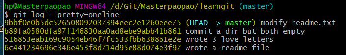
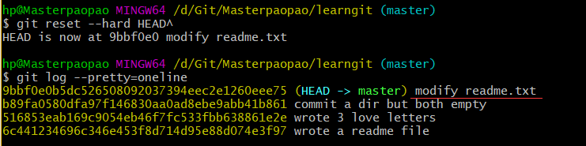
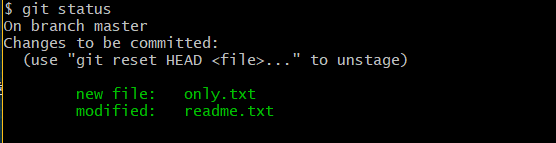
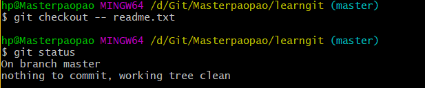
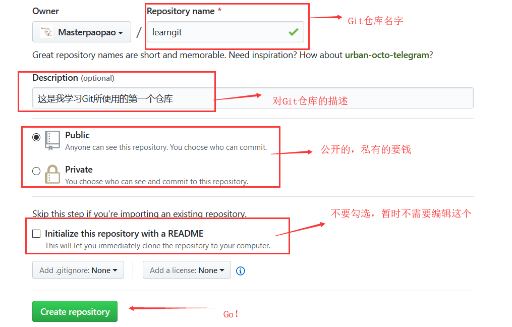
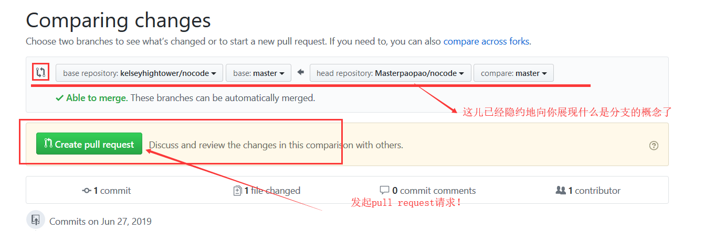

# 目录

* [Git是什么？](#git%E6%98%AF%E4%BB%80%E4%B9%88)
  * [一\.概念详解](#%E4%B8%80%E6%A6%82%E5%BF%B5%E8%AF%A6%E8%A7%A3)
      * [1\.Git的诞生](#1git%E7%9A%84%E8%AF%9E%E7%94%9F)
      * [2\.为什么要用Git](#2%E4%B8%BA%E4%BB%80%E4%B9%88%E8%A6%81%E7%94
%A8git)
  * [二\.操作Git](#%E4%BA%8C%E6%93%8D%E4%BD%9Cgit)
      * [1\.安装Git](#1%E5%AE%89%E8%A3%85git)
      * [2\.配置Git](#2%E9%85%8D%E7%BD%AEgit)
      * [3\.修改启动路径](#3%E4%BF%AE%E6%94%B9%E5%90%AF%E5%8A%A8%E8%B7%
AF%E5%BE%84)
      * [4\.安装版本库](#4%E5%AE%89%E8%A3%85%E7%89%88%E6%9C%AC%E5%BA%93
)
      * [5\.选择记事本](#5%E9%80%89%E6%8B%A9%E8%AE%B0%E4%BA%8B%E6%9C%AC
)
      * [6\.提交文件](#6%E6%8F%90%E4%BA%A4%E6%96%87%E4%BB%B6)
      * [7\.Git加练](#7git%E5%8A%A0%E7%BB%83)
      * [8\.初步小结](#8%E5%88%9D%E6%AD%A5%E5%B0%8F%E7%BB%93)
  * [三\.时光穿梭](#%E4%B8%89%E6%97%B6%E5%85%89%E7%A9%BF%E6%A2%AD)
      * [1\.修改文件](#1%E4%BF%AE%E6%94%B9%E6%96%87%E4%BB%B6)
      * [2\.版本穿梭](#2%E7%89%88%E6%9C%AC%E7%A9%BF%E6%A2%AD)
      * [3\.版本回退](#3%E7%89%88%E6%9C%AC%E5%9B%9E%E9%80%80)
      * [4\.版本穿越](#4%E7%89%88%E6%9C%AC%E7%A9%BF%E8%B6%8A)
      * [5\.穿梭小结](#5%E7%A9%BF%E6%A2%AD%E5%B0%8F%E7%BB%93)
  * [四\.Git原理](#%E5%9B%9Bgit%E5%8E%9F%E7%90%86)
      * [1\.工作区和暂存区](#1%E5%B7%A5%E4%BD%9C%E5%8C%BA%E5%92%8C%E6%9
A%82%E5%AD%98%E5%8C%BA)
      * [2\.继续追问](#2%E7%BB%A7%E7%BB%AD%E8%BF%BD%E9%97%AE)
      * [3\.git diff](#3git-diff)
      * [4\.撤销修改](#4%E6%92%A4%E9%94%80%E4%BF%AE%E6%94%B9)
      * [5\.删除文件](#5%E5%88%A0%E9%99%A4%E6%96%87%E4%BB%B6)
      * [6\.原理小结](#6%E5%8E%9F%E7%90%86%E5%B0%8F%E7%BB%93)
  * [五\.初见Github](#%E4%BA%94%E5%88%9D%E8%A7%81github)
      * [1\.生成SSH](#1%E7%94%9F%E6%88%90ssh)
      * [2\.配置Github](#2%E9%85%8D%E7%BD%AEgithub)
      * [3\.远程仓库](#3%E8%BF%9C%E7%A8%8B%E4%BB%93%E5%BA%93)
      * [4\.修改项目](#4%E4%BF%AE%E6%94%B9%E9%A1%B9%E7%9B%AE)
      * [5\.克隆项目](#5%E5%85%8B%E9%9A%86%E9%A1%B9%E7%9B%AE)
      * [6\.参与开发](#6%E5%8F%82%E4%B8%8E%E5%BC%80%E5%8F%91)
      * [7\.幻想旅行](#7%E5%B9%BB%E6%83%B3%E6%97%85%E8%A1%8C)

---

Author：Masterpaopao

本博客已经上传Github：https://github.com/Masterpaopao/masterblog/tree/master/Git%E4%B8%8EGithub

Git是目前世界上最先进的分布式版本控制系统（没有之一）。

学习参考文献：https://www.liaoxuefeng.com/wiki/896043488029600

## 一.概念详解

#### 1.Git的诞生

说白了就是早期的分布式系统龙争虎斗，最后惹了Linus大神（Linux的创始人）不高兴

Linus花了两周时间自己用C语言写了一个分布式版本控制系统，这就是Git！一个月之内，Linux系统的源码已经由Git管理了！最重要的是，Git是完全开源免费的，为无数个优秀的开源项目提供了存储的地方，直到今天，Git俨然成为了最好用的分布式版本控制系统！

#### 2.为什么要用Git

版本控制系统分两种，集中式版本控制系统和分布式版本控制系统

而Linus最痛恨的就是集中分布式版本控制系统，必须联网，必须依附于中央服务器而工作。

问题是如果中央服务器断电了怎么办！能把人活活憋死！

所以分布式版本控制系统应运而生，没有中央服务器，每个人的电脑都是一个完整的版本库，这样一来很多人可以自由地同时下载一个版本，进行优化，再推送过去申请优化！

无需担心自己的电脑挂了，可以从其他人复制一个版本就可以了，根本不怕断电！但是分布式版本控制系统也是有中央服务器的，比如说你的同事今天都没来上班，或者你连接不到网络另一端的电脑，或者你只是一个快乐的自学者，就从中央服务器上面下载一个版本，它是作为总服务器的存在！

当然了，集中式版本控制系统也不是没人用，就是最著名的SVN系统，具有稳定性，人数用得最多。

&nbsp;

## 二.操作Git

#### 1.安装Git

安装Git必然分两种情况，Linux上安装与Windows上安装

最好的选择，必然是在Linux上开发，这是必然的，但是为了降低学习成本，我们最好还是建立在windows上开发

以下的笔记全部都建立在Windows开发的基础上

&nbsp;

因为git官方网站是国外源，下载巨慢，我在这儿提供一种快速下载的技巧

下载迅雷并打开，复制这个链接（64位电脑系统）https://github.com/git-for-windows/git/releases/download/v2.22.0.windows.1/Git-2.22.0-64-bit.exe

然后你会发现下载的很快，安装的时候直接一路默认即可。

#### 2.配置Git

安装完成以后，打开win10左下角菜单栏，不出意外会有个Git Bash，能成功打开就是安装完毕

输入git --version，看到版本是2.22.0，说明一切正常


安装以后，我们必须向git自报家门，以global全局的方式通报你的名字和邮箱地址

```
git config --global user.name "Your Name"
git config --global user.email "email@example.com"
```


注意--global这个命令的参数，用了这个参数，表示你这台机器上所有的Git仓库都会使用这个配置，当然也可以对某个仓库指定不同的用户名和Email地址。

#### 3.修改启动路径

注意，学习Git需要对Linux有一定的基础哦，不然有些命令就会懵逼的

我们注意到，打开Git Bash的时候，路径是默认为c:/users/hp，这个默认路径肯定是不行的


难道我们的仓库就放在C盘吗，那肯定不是。

所以我们需要更换启动Git Bash时的默认路径，首先我先在windows创建文件夹，放在D:\Git\Masterpaopao

然后右键对Git Bash点击打开文件所在的位置，对Git Bash右键属性，在快捷方式那儿修改两处地方


改好了之后，点击应用保存设置，我再重启Git Bash（警告：路径不要含有中文，这是一个好的习惯）

发现打开之后，默认路径被修改成功，然后就可以快乐地安装版本库了


#### 4.安装版本库

当我们设置好启动路径之后，我们可以正式配置版本库，用于克隆你所期望的项目版本库

使用mkdir命令创建一个git空仓库文件，命名为learngit，并进去之后，进行init配置


注意，将learngit设置成默认仓库之后，会产生一个.git的配置文件

千万不要乱改，这个是依赖设置的隐藏文件，不能直接发现，如果你想看到它，应输入ls -ah


####  5.选择记事本

为什么要说这个呢，本次diss只针对微软开发的记事本，因为它有一个致命的缺陷——

我们就在桌面里面创建一个叫abc.txt的的记事本文件，往里面填写汉字


我们知道，想要编码汉字进行保存必须要使用UTF-8编码，但是我们把这个abc.txt的后缀直接改成abc.md


我们打开abc.md文件看看发生了什么？


我们写的汉字直接乱码了，这说明了什么？微软的记事本采用了一种编译UTF-8方法来保存我们记事本里面的汉字

当我直接将这个文件后缀直接改成另外一个软件的时候，赫然成了乱码！

那么微软的记事本到底是怎么样将记事本里的汉字内容编译成UTF-8呢，这就是我们要说的致命的缺陷——

他们在每个文件的开头添加了0xefbbbf（十六进制）的字符，来进行UTF-8编码，所以你直接用记事本文件去做项目的时候你会遇到许多难以忍受的问题，文件直接编译失败，第一行遭遇到报错等等。

&nbsp;

所以我们windows的用户直接弃暗投明，去下载一个真正好用的记事本编辑器，Notepad++

这儿是官网地址，在这里面下载符合你系统位数的版本即可

https://notepad-plus-plus.org

这儿是64位电脑版本的7.6版本的Notepad++下载链接，复制到链接到迅雷下载，秒下完，或者有百度云会员的，复制到百度云下载

https://notepad-plus-plus.org/repository/7.x/7.6/npp.7.6.Installer.x64.exe

&nbsp;

不出意外的话，这个的默认设置就是UTF-8编码无BOM版本，不放心的就自己亲自确认一下


#### 6.提交文件

Notepad++配置好了之后，我们直接编写一个txt文件，里面的内容如下：

```
Git is a version control system.
Git is free software.
```

填好之后，按ctrl+s保存，它会询问你保存到哪儿，千万别保存错位置，要保存到learngit的那个目录，并命名为readme.txt，也就是我下图中的效果


编写一个文件好了之后，我们开始走向提交到git的流程，回到我们的git bash命令窗口

可以先ls一下看看是不是真的有了个readme.txt

然后输入git add readme.txt，这是告诉git我要把这个文件添加到仓库


添加到仓库之后，还要进一步的提交和诠释说明，完成提交文件到仓库的步骤，使用git commit命令，-m参数后补充你要给出的备注信息，这样一来，别人看你提交成功以后还能看到你的备注，这才是真正的分布式。

输入git commit -m "wrote a readme file"这个命令，不出意外的话，你会看到这样的反馈


这样，你就完成了一个文件的提交，提交到我们设置的git仓库内

那么有人就会忧伤了，难道add添加一个文件就要commit提交并报告一次吗，这岂不是难受到爆炸

不会的，add也可以一次性多次添加，最后只需要一个commit提交并报告就一次完成多个文件的提交

&nbsp;

我们继续用Notepad++创造几个txt文件，弄到learngit目录下，尝试一下多个文件的添加


然后接下来就是一口气全提交，只需要一个commit命令，然后简单描述一下


这样一来，我就完成了多个文件的提交，并告诉Git我提交了三封情书。

#### 7.Git加练

在上面，我们操作了Git去提交单个文件甚至多个文件

但是我们忽略了一个很重要的问题，文件夹应该怎么添加提交呢？

我们直接在正确的learngit目录下面创建一个叫master的空目录

然后一套add+commit走起，却意外地发现了报错


这说明了git并不支持提交空文件夹，唯一的办法就是在这个空文件夹里面添加空文件


有Linux基础的同学应该知道我在干什么，没基础的继续使用notepad++创建一个没有内容的empty.txt放在这个master目录下面，也是一样的，弄好了之后继续add+commit


怎么样，我写的中式英语阐述理由是不是通俗易懂？哈哈哈！

这样一来，我们就会如何提交单个文件，多个文件和文件夹到Git仓库的操作了。

#### 8.初步小结

在上面，我们总算是完成了git的入门，从安装git到配置git，从安装版本库到提交文件，我们已经提前嗅到了分布式系统的强大精髓之处，学习Git确实要真真切切的Linux基础，这是毫无疑问的。

我们在指定的目录下，创建一个文件夹，使用git init将它指定成git仓库

然后我们可以使用Linux的vim或者Windows的Notepad++来创建txt文件，并添加内容

在正确的git仓库目录（也可以是子目录）之下，使用add+commit组合向仓库提交与添加

其中，可以多次add+一次commit进行多个文件的添加提交，并不能提交空目录。

&nbsp;

## 三.时光穿梭

#### 1.修改文件

在上面，我提交了一个readme.txt，现在可以进行尝试性修改里面的内容

有Linux基础的使用vim修改，没有基础的使用Notepad++修改并保存

```
Git is a distributed version control system.
Git is free software.
```

修改好内容之后，我们来看看现在git的状态：输入git status


这条git status命令很好地告诉我们文件已经被修改了，但是还没有提交保存

这个时候我们需要考虑到人的健忘症，也就是你忘记了修改前的内容是什么——

这个时候再输入这条命令：git diff readme.txt，我们非常清楚地看到下面的信息


可以说是非常贴心的提示了，还用了红绿配色方案，非常地直观了得。

&nbsp;

那么我们应该如何保存修改呢，当然是一套add+commit走你，并在commit上说明修改


然后就成功提交了修改，现在再用一波git status查看当前仓库的状态


所以现在我们学会了修改仓库内的文件，并重新添加提交的过程

还额外学会了查看当前仓库状态和查看修改信息的详情。


#### 2.版本穿梭

我们知道，实际上我们不可能修改一次，我们后续还有无数次修改

这个时候应该使用git log来查看历史修改的信息


我们可以看到，修改的日志以倒叙的方式显示在屏幕上，并且修改提交的报告单独成行显示

这样我们经历了几次版本修改，在日志中一目了然，但是如果日志过多应该怎么办?

后面可以添加参数：git log --pretty=oneline

这样一来，我们就以单行的形式展示每一次版本修改，方便我们快速定位，也是倒叙的形式



看到了吗，不变的是那个长长的黄色字符，那就是版本号的id，每提交一个新版本，实际上Git就会把它们自动串成一条时间线，产生出来的版本号几乎不会与其他重复，提供了准确定位的途径。

&nbsp;

现在该怎么版本回退呢？我们可能注意到了，最新的版本号多出来了这样的括号


这其实是代表当前版本的标志，HEAD是一个指针，它的出现，为版本的来回穿梭提供了条件

我们可以看看学习参考文献中给了两幅生动形象的图，展现了HEAD指针的工作


所以我可以将版本来回穿梭到前面的版本，也可以将版本恢复回来，并不会版本回退后删除掉后面的版本

现在见识到了HEAD指针的强大之处，我们先来学习一下版本回退吧


#### 3.版本回退

为了便于教学版本穿梭，我的readme.txt应当改动三次，所以我们复习下前面的修改文件相关命令

再修改一次readme.txt，当你修改完成以后，输入git log --pretty=oneline应当看见readme.txt的三次修改


前面三个版本代表第二次修改，第一次修改，未修改的版本

现在来学习基于指针的版本穿梭的命令

输入git reset --hard HEAD^ ，这代表指针回退到上一个版本，输入命令过后

再输入git log --pretty=oneline看看，现在的HEAD指针指向哪儿了



我们成功地回退到了上一个版本，但不代表我们的第二次修改版本被删除了，是可以回去的

顺便验证一下版本回退后的文件是否回到了上一次修改的内容


上面学习了用指针回退上一版本的命令，但是我们必须考虑到一个情况

如果我想回退前面几个的版本呢？这个时候就要用到基于版本号的回溯命令了

我们继续回退到readme.txt没被修改的那个版本，我们只需要输入版本号前面几个字符

因为git会根据前面几个字符检索到完整的版本号，但也不能只输入一两个字符，容易存在重复的情况

所以我输入了git reset --hard b89fa，再查看日志发现，我又回到了上一个版本


自己再去看看readme.txt是不是回到了最初的文件内容。

当然了，还记得上面的git reset --hard HEAD^吗？这个是回退到上一个版本的命令

如果你从一开始就知道要回退到上上一个版本，那就是输入git reset --hard HEAD^^

后面的两个^^代表两次指针移动，如果是回退到上100个版本呢？输入git reset --hard HEAD~100

好了，现在我们是时候回到最新的版本了，也就是版本穿越回去。


#### 4.版本穿越

我们意识到了一个严重的问题，现在再git log，并不能看到之前的版本号了，这让人怎么穿越回去？

首先第一种笨方法就是，你的git bash窗口一直没有关掉，可以向上翻记录

找到那个版本号，输入前几位，穿越回去，也是一个快速的方法。

但是我们必须假设极限生存情况，也就是前面没有任何记录，或者是你第二天起床后悔了，尽管你对Git的强大很有自信心，但是不知道回去总会令人心慌的。

直接输入git reflog这条命令，访问存储在本地的日志系统，它会详细地记录你干了什么


我标出来的红线就是我想穿越回去的那个版本，前面已经给出了版本号前几位，OK，让我们回去吧

输入 git reset --hard 9ea90f8，直接回去到最新的版本，然后查一下文件的内容是否恢复


哦，差点忘了git log命令，这个也输入一下看看效果


经过上面时光穿梭的学习，我们学会了版本回退与版本穿越，灵活在各个版本之间进行来回切换

#### 5.穿梭小结

当你在learngit仓库修改文件的时候，你并没有add+commit，这时候你可以

git status：查看当前git仓库的状态

git diff file(你修改文件的名字)：查看修改前后的对比信息

&nbsp;

然后你直接add+commit之后，第二天早上起来不知道你做了什么，这时候你可以

git log：以又长又详细的方式展现出操作记录

git log --pretty=oneline：以单行打印的简略信息展现出操作记录

git reflog：以快速简约的方式展现出历史操作记录，这条方法推荐使用

&nbsp;

当你看完你的操作记录之后，你后悔了，你想要回到上一个版本，这时候你可以

git reset --hard HEAD^：一个^代表一次指针移动，这条命令是回退到上个版本

git reset --hard HEAD^^：回退到上上个版本

git reset --hard b4sdsf：回到指定的版本，可以回退也可以穿越，版本号会自动补全，不用全输入

&nbsp;

## 四.Git原理

我们在上面，学会了提交文件，学会了版本来回穿梭，内心里面肯定会有一个疑问，也不敢说出口

现在我们一次性搞定，提交文件到仓库为什么一定要add+commit分两步？

#### 1.工作区和暂存区

让我们深入一波Git底层，Git与集中式版本管理系统不同的是，多了个暂存区的概念，也正是因为这个暂存区的概念，Git逻辑清晰，功能强大，成为了最先进的分布式版本控制系统。

先来看看工作区的概念，所谓工作区就是learngit文件夹，是经过git init配置好的git仓库

我们知道，配置git仓库的时候，产生了一个.git的隐藏目录，这儿是Git的版本库

在这个.git版本库里面最重要的概念就是暂存区，可以称作为stage（或index）

&nbsp;

所以我们的add+commit的详细流程到底是什么？

就是我在工作区的时候创建或修改了文件或文件夹，然后使用add命令的时候，将文件或文件夹加入暂存区，再使用commit提交的时候，将暂存区的所有内容正式同步到当前master的分支Git仓库，产生了新的版本号，HEAD指针向上移动指向了新的版本号，完成Git仓库内容的更新。


请确保你能读懂我上面的一段话以及配图，下面我们将实践出真知，拆开add和commit的两个步骤

首先我将再改一次readme.txt的内容，然后再创建一个only.txt添加内容，这样弄就是两个任务

弄好了以后，直接git status查看当前的状态


这张图片很好地告诉我们，我们修改了两个任务，但并没有加入到暂存区

现在我直接两下git add，再来看看此时的git status状态



这张图可以看出来，这次告诉我们暂存区来了两个任务，并用绿色表示保存有效，现在要做的就是将暂存区里面的内容给提交覆盖上去，成为新的版本号，所以使用commit提交，最后来看看状态


现在就说明了暂存区和工作区没有任务需要执行，表示工作区干净了，同时我们的Git仓库的HEAD指针已经指向了新的版本号，完成了一次版本的更新。

&nbsp;

刚才，我将工作区和暂存区拆开来讲，将add和commit拆开来讲，想必你已经弄懂了添加提交文件的时候Git底层发生了什么。

但这个时候又要抛出来一个灵魂问题：

为什么commit之前还要add一次，为何不能直接commit呢？先用add加入到暂存区有什么用?


#### 2.继续追问

虽然上面有一连串的问题，但是你内心还是清楚可Git提交时候底层发生了啥，知道文件要从工作区，加入到暂存区，然后再将暂存区的内容同步上去成为新的版本，现在我们来一个试验，帮助你更深理解。

现在我们修改一下readme.txt，添加第三行的内容


然后我们将这个改动进行add添加到暂存区，现在我们继续改动一次readme.txt，添加第四行的内容

现在，我直接commit提交！


现在，我们来看看，提交后的版本到底是什么？

我们可以有这样的一条命令，能够查看版本号的工作区和当前的工作区的对比

输入git diff HEAD readme.txt，我们可以看到这个样子


很显然，我们也能猜到，第二次改动readme.txt当然没有同步上去，因为第二次改动又没加入到暂存区，然后我们又弄清楚了暂存区的作用就是用来被同步的，所以我们进一步git status看看


看，第二次改动的内容还未被add + commit呢，所以我们上面究竟发生了什么，我们捋一捋

第一次修改readme.txt --> git add --> 第二次修改readme.txt -->git commit

最后的结果很显然，我们只完成了第一次修改的add+commit，所以这个顺序其实就等于

第一次修改readme.txt --> git add -->git commit --> 第二次修改readme.txt

会发生这样的结果，是因为暂存区的概念，第二次修改没加入暂存区，就不可能被提交。

（经过我看参考学习文献的留言，我发现有些人存在一个致命的思维误区，就是有些人得出的实验结果是第二次修改提交了，而第一次修改没被提交，大哥，你是不是跟着上面四步操作以后，立马cat readme.txt了？结果展现出来的文件是第二次修改的四行内容。我在上面已经说过了，你可以理解为第一次修改的时候直接add+commit，然后第二次修改内容的时候，并没有add+commit，这个时候你去看readme.txt，肯定是你第二次修改的内容，这不是废话吗？只不过这第二次修改没有add+commit，你直接看git status就行了，不用我多说了。）

&nbsp;

现在，我相信你真的理解了我上面的操作，对暂存区和工作区有了一个清晰的认识，让我们回到最初的灵魂追问，就是为什么要暂存区？为什么要先add到暂存区？为什么不能直接commit呢？

首先，Git与集中式版本控制系统最大的不同之处就是加入了暂存区的概念，正是因为有这个暂存区的存在，成为了Git最大的智慧，也许你不知道我在说什么？

我们假设一个生活场景，我们上淘宝京东买东西的时候，是不是需要先挑选好商品，挑来挑去，放入购物车，然后一次性提交付款？购物车就是我们的暂存区，如果没有购物车，我们看一个商品买一次，这样的用户体验，淘宝京东等电商能火才怪。

那么我们的Git也是一样的，有些时候的修改并不是必要性，而是试探性，但是如果不给暂存区，我们直接commit了，影响了原来的版本系统怎么办？做任何修改直接被commit提交，这无疑是一个糟糕的体验。

所以，Git操作的是什么，不是文件，是修改！

&nbsp;

（我又往下翻了一些留言，有些同学因为git diff命令吵起来了， 我仔细研究了一下，发现这个很有意思）

#### 3.git diff

我曾在前面讲过git diff filename这条命令，他是查看文件修改前后的对比。

但是上面也有一条新的命令，git diff HEAD filename，我们输入看看


令人诧异的是，这两条命令返回的结果居然一样，也不要着急，还有一条命令

输入git diff --cached  filename看看


不返回任何结果。

&nbsp;

我们来捋一捋这三条命令到底有什么区别，先来git status看看，我当前工作区的状态是怎么样的


嗯，我上面的第二次修改readme.txt还未add+commit，还停留在工作区的变化，这就是当前的状态。

&nbsp;

①git diff filename

这条命令我在前面讲述过，就是你修改文件以后，还未加入add+commit，你如果突然健忘了，可以输入这条命令看看你改了什么，再决定要不要add+commit，所以输入这条命令的效果就是这样


它告诉我，我修改readme.txt的方式是新添加了一行内容。

所以，git diff filename是比较某个文件在工作区与暂存区的区别，用白话说，我在工作区修改了一个文件，还没有add+commit，用这条命令查看修改的方式。

&nbsp;

②git diff --cached  filename

为什么我输入了这条git命令，没有任何反馈结果呢？


因为这个命令是比较某个文件在暂存区与当前版本库的区别，看明白了吗？

我第二次修改的readme.txt并没有add+commit，未改动加入暂存区，所以这个时候的暂存区的内容和当前版本库的内容是一模一样的，自然不会有任何区别。

&nbsp;

③git diff HEAD filename

这个命令是留言里面同学们争论的核心，也就是git diff HEAD filename与git diff filename的区别

我当然没有加入争吵，而是选择上博客园搜文章，发现了一篇粗暴总结的文章，一下子秒懂

https://www.cnblogs.com/chenfulin5/p/8674565.html

所以git diff HEAD filename到底是什么呢？为什么返回的结果与git diff filename一样呢

这一切只是一个巧合，问题的核心在于我们的暂存区内容与当前版本库的内容是一样的！

1）git diff filename比较工作区与暂存区的变化

2）git diff HEAD filename比较工作区与当前版本库的变化

又因为暂存区的内容与当前版本库的内容一样，所以这两条命令返回一样的结果！

&nbsp;

我觉得你应该是看懂了我们的描述，接下来我们就要实践一下，因为实践出真知！

让我们将第二次修改的readme.txt加入暂存区，好，在这停顿！


这个时候，工作区，暂存区，当前版本库（也可以理解为master分支的Git仓库）发生了什么？

工作区的内容和暂存区的内容已经同步一样了，而当前版本库还未更新readme.txt

让我们撸一遍上面的三个命令，首先git diff filename，毫无疑问是不返回结果的


因为修改已经加入暂存区，而这条命令比较工作区和暂存区。

然后再来看看第二个命令git diff --cached  filename，绝对返回结果，因为这两者比较后面两个


这条命令就是比较暂存区与当前版本库，暂存区的文件多了一行内容，还未同步到当前版本库。

再来最后一条命令git diff HEAD filename，同样也返回结果的


最后的命令是比较文件在工作区与当前版本库的区别。

你发现了吗，当我add添加到暂存区以后，这时候后面两条的命令返回的结果又变得一样了，而留言内同学争论的两条命令返回的结果就不同了。

好了，我直接继续commit提交吧，将暂存区同步到当前版本库，这个时候三条命令都不返回结果了


因为此时工作区，暂存区，当前版本库的内容全部都一致。


#### 4.撤销修改

这个时候，凭借着我的文字描述功夫，你绝对弄懂了工作区，暂存区，当前版本库的概念，并弄懂了这三个区域的工作流程。如果你点头了，恭喜你，我写作的目的已经达到了，你已经毫无压力地到我的学习参考网站继续往下阅读，而不再需要在留言区跟别人吵架。

但我是一个有始有终的人，我会继续写完，直到你成功地用上了Github，将你的工程文件放上去。

好了，现在我们继续修改readme.txt，再加一行内容，处于未add+commit的状态


但是加完这句话，又后悔了，还好这个文件修改并没有加入暂存区

这个时候其实可以再看看git status，探寻我们前面忽略的细节


这条命令已经告诉我们了，撤销修改的时候我们应该做什么，输入git checkout -- filename

所以我们输入git checkout -- readme.txt（中间的两个杠不能省略，省略了就是后面的分支命令）


看到了吗。文件被撤销修改了，这个时候的工作区是干净的，无需任何操作。

那么其实还存在一种情况，就是文件被第一次修改后加入了暂存区，然后又第二次修改了，使用checkout命令只能撤销第二次修改，影响不到第一次修改被加入暂存区的事情，这个理解了就行。

&nbsp;

现在我们要面对第二种情况，当你修改文件之后，还加入到了暂存区，还未commit，这个时候你应该怎么撤销呢，废话不多说，我先修改+add一下，方便教学，事实上，再git status了，它还是会告诉你怎么做


说明HEAD指针不光可以回退版本，还能回退暂存区，直接输入git reset HEAD readme.txt


回退暂存区之后，我们发现，此时的状态变成了文件未修改，等待被add+commit

继续回到上一步怎么做?还记得吗?直接git checkout -- readme.txt，撤销修改，回到什么都没发生的状态



这个时候，很多人就会关心操作的是否会被记录，我只想说，不会被记录，尝试输入git log 与 git reflog吧

&nbsp;

最后一种情况，应该不需要我多教了，就是add+commit后怎么撤销，直接版本回退即可。

&nbsp;

经过这个小节，你绝对加深了对这句话的理解：Git跟踪的不是文件，是修改。


#### 5.删除文件

在前面我们学习了如何添加提交，如何修改，也学习了如何撤销提交，如何撤销修改，现在我们要来到最后一个阶段，删除文件和撤销删除文件两大步骤。

不出意外，留言区又成功地吵起来了，但是我相信你仔细地阅读了我上面所写的文字，你应该弄懂了三区概念——工作区，暂存区与当前版本库。所以你不必参与留言区的吵架，因为你真真切切弄懂了这些原理，接下来就好好看我的文字吧，我将拆分三个步骤来讲！

&nbsp;

现在我输入ls，有一个only.txt。我看他不爽，我要输入rm only.txt来删掉它（手动删除都可以）


删掉以后，我们来看看当前git status的状态


它告诉我们，我们需要进一步的rm+commit来更新到当前版本库。

这说明了rm命令实际上就跟vi命令一样，不管是删除也好还是修改也好，都一样，只处于工作区的变动。

所以撤销删除就跟撤销修改一样，只需要git checkout -- only.txt


这个文件就回来了，这个非常好理解。

&nbsp;

现在，我们搞定了只处于工作区的变动，学会了删除和撤销删除，现在我们来看看删除了文件之后，改动提交到暂存区之后的事情。

继续rm删除only.txt，并进一步git rm only.txt，使暂存区与工作区同步，而未进行下一步commit


这个时候我们来捋一捋，现在工作区和暂存区都没了only.txt，但是当前版本库还存在only.txt

如果我后悔了呢，其实你也注意到了上图红线，你也回忆起了上面撤销修改文件小节的内容，

直接输入git reset HEAD only.txt，这个时候暂存区就回退了，查看git status


继续git checkout -- only.txt，直接回到最初的起点，无事发生，仿佛only.txt没有发生过


所以，本节删除文件的内容实际上和上面的撤销修改的内容差不多，你可以这样理解，删除其实就是一种修改，所以操作命令都是一样的。

&nbsp;

如果你确实要删除，那么直接rm + git rm + git commit即可，如果你后悔了，想让它回来，版本回退即可。

要注意一个误区，就是你先创造文件再删除文件，这时的暂存区与版本库是没有你创造的那个文件的，遇到这种情况，格外注意一下即可。


#### 6.原理小结

在上面，我花了很大的笔墨向你解释工作区、暂存区与当前版本库的区别与作用。

你应该清楚的知道一次版本提交，是如何走过这三个地方的，我在这儿无需再多解释。

&nbsp;

我们在工作区改动文件、添加到暂存区，提交到版本库这三个阶段走来，git diff总能发挥出对比状态的作用

①git diff filename：比较文件在工作区与暂存区的变化（在工作区改动文件，还未add+commit）

②git diff --cache filename：比较文件暂存区与当前版本库的变化（已经将文件添加进去暂存区，但还未提交）

③git diff HEAD filename：比较工作区与当前版本库的变化（说白了，就是看你的改动还没被commit）

&nbsp;

现在我们弄懂了各个阶段如何去比较进程，其实日后并不常用这些，但是做一个了解是非常棒的

说实话，其实修改与删除都属于"修改"，操作没有本质区别，所以我将这两个放到一起总结

①当你在工作区修改或删除的时候，想要撤销，统一git checkout -- filename（两个横杠不能省略）

②当你的修改或删除真的要确定的话，进一步git add/rm，然后commit上去。如果你执行了加入暂存区过后，你后悔了，想要撤销就git reset HEAD filename，将暂存区的变动回退。当然了，你还可以进一步地git checkout -- filename直接回到最初的状态，装作无事发生。

③当你的修改或删除，都走了add+commit的步骤，这个时候直接版本回退即可。

&nbsp;

## 五.初见Github

现在终于到了万人期待的时刻，我们就要正式启动github工程了

github并没有被墙，就是网速很慢，所以请你注册一个账号，填写你最初认识Git自报家门时候所写的名字，比如我，写的就是Masterpaopao，作为我的用户名，还有你填写的邮箱地址，作为注册账号的邮箱。

当然了，也随便你，我这么做只是一个强迫症。

#### 1.生成SSH

我们知道，Git是最强大的分布式版本控制系统，对中央服务器的依赖性不强，但还是会有，供一些自学者访问进行克隆项目到本地，但是我们搞一台服务器作为中央服务器，24小时开机，学习成本太高了。

好在我们有个Github的神奇网站，这个网站就是提供Git仓库托管服务的，所以，只要注册一个GitHub账号，就可以免费获得Git远程仓库。

那么该如何将本地的仓库同步到远程的仓库呢，也就是同步到Github网站上面，将本机与远程进行仓库通信，进行传输文件，就要用到SSH协议。

&nbsp;

首先你需要认识到什么是用户主目录，哈哈，我的教程实际上并不排斥零基础的人，所以我有必要花费笔墨描述一下什么是用户主目录。在开始菜单栏直接输入cmd，如果你没有捣鼓过cmd的启动路径的话，上面给你的路径就是你的用户主目录


如果你不放心，用户主目录的组成应该是默认系统盘+用户文件夹+当前主机的名字，或者你直接暴力输入cd命令，它会自动切换到用户主目录


当你找到了之后，如果你以前捣鼓过SSH，那么就进去这个目录查找一个叫.ssh的隐藏文件，注意，是隐藏文件，不知道怎么找隐藏文件的请百度。

如果你找到了，那么里面应该还会id_rsa和id_rsa.pub这两个文件，你可以直接跳过这个小节，等待配置。

没有的同学，其实我也没有，所以一起来弄SSH吧

我建议你直接用cmd来生成ssh，因为它的工作默认路径就是用户主目录，而Git Bash的工作目录在前面就已经被我修改了，生成的.ssh文件会跑到我们指定的D盘目录，那样并不好。

在cmd里面输入`ssh-keygen -t rsa -C  "YourEmail@example.com"`(你向Git自报家门时填的邮箱)

然后遇到问题提示，直接无脑回车就行，密码不需要设置


这样一来，你的用户主目录下就生成了.ssh的隐藏文件，里面有id_rsa和id_rsa.pub两个文件，这两个就是SSH Key的秘钥对，id_rsa是私钥，不能泄露出去，id_rsa.pub是公钥，可以放心地告诉任何人。


#### 2.配置Github

弄好了之后，让我们登陆上Github网站https://github.com/

登陆自己的账号名字，不出意外应该是这样


很标准的Github三无界面，什么都没有，然后点击右上角的头像，点击Settings，进入设置界面

然后找到SSH相关的选项，我们就找到配置SSH的地方


然后直接点击New SSH Key，进去之后随便填写个标题，然后将自己.ssh文件夹下的id_rsa.pub里面的内容填进去，就可以了（友情提示，可以对id_rsa.pub右键使用Notepad++打开复制内容进去）


然后点击确定，你就可以看到SSH的状态了


这意味着你的本机已经可以跟Github上的仓库通信了，但是我要告诉你的是，在GitHub上免费托管的Git仓库，任何人都可以看到，并进行下载，所以不要将个人敏感信息加进去哦！

#### 3.远程仓库

现在，你已经打通了本地Git仓库与Github仓库的通信，你已经迫不及待想要把你的项目放上去了

我们现在要做的就是将我们现在练习用的Git仓库——也就是learngit文件夹，给同步上去，当同步成功以后，我们自主再尝试将自己的项目工程文件同步上去，加强锻炼即可。

首先回到Github首页，点击左边的创建一个仓库


然后进去后仓库的名字填写learngit，随便填写点描述，就直接创建



然后我们会跳转到这个页面，先不要乱点，这总体的意思就是成功创建了一个Git空仓库，并知道了我们下一步应该怎么做。


现在我们回到Git Bash，准备将我们练习用的Git仓库推送到Github上的仓库来，根据上图红框的提示，我们已经知道如何推送上去了

```
git remote add origin git@github.com:Masterpaopao/learngit.git
```

在你的learngit的目录下面，直接输入这条命令，注意，后面的Masterpaopao得改成你的Github账户用户名，或者你直接推送给我也行，但我的Github没有你的SSH，这个操作不会生效。

&nbsp;

（查看了一下留言，发现不少同学因为这个命令报错，我看了一下，如果你按照我的教程一步一步走，绝对不会出问题，出问题就是你的学习”不干净“，没有严格按照我的步骤走，无非就是向Git自报家门的时候，名字和邮箱的输入，ssh配置是否成功，你设置的推送邮箱链接是否与你自报家门的邮箱一致等等，请自主百度解决！）

我们先来拆分一下上面的命令组成，git remote，就是管理远程仓库的意思，add origin，就是添加远程库的意思，origin是可以改的，只是给远程库取个名字而已，然后后面的一大串就是远程库的地址，这是Github直接提供给我们的，当我们输入了这条命令之后，肯定没有反应


因为这条命令相当于告诉Git有这么一个远程仓库，接下来就是正式地推送步骤

```
git push -u origin master
```

这条命令是什么意思呢，直接字面翻译，就是将master分支的这个Git仓库推送到远程库，当你输入的时候，因为你是第一次使用Git与Github，会有个SSH链接让你确定是否信任，直接输入yes就可以，以后不会再询问。

而那个-u是一个初始参数，因为我们是第一次推送，这样做是将本地Git仓库与Github上远程仓库给关联起来。


现在来看看你的Github页面，刷新一下，你会发现同步成功了


现在的你，一定很快乐。

&nbsp;

来强调一下这个git remote命令，这个命令用来管理远程仓库的，如果你的办公地址不止一个，比如家里和公司，那么你需要再配置一下新电脑的SSH，然后git remote添加进去这个新电脑的远程仓库。


#### 4.修改项目

当Github上的Git仓库同步成功以后，从现在起，你已经叫这个Github远程库为origin，并已经添加了链接，而且你的learngit仓库是处于master分支（下一篇笔记会细讲分支，我们现在就一个master分支），当你修改你的仓库的时候，你先把改动同步到Github上面，只需要一个命令git push origin master，可以发现，我们少了个-u参数，因为我们不再是第一次推送了，关联已经确立了。

现在，让我们再次修改一下readme.txt，将内容改成你的学习感言（无Linux基础直接用记事本改）


然后走一套git+commit流程，最后直接输入git push origin master同步上去，最后看看我们的Github页面


#### 5.克隆项目

所谓的克隆项目，实际上就是与上面相反的过程，上面是从本地仓库推送同步到Github仓库，使用了git push

现在我们要做的就是将远程仓库的内容，同步到本地仓库里面，这个操作就叫做克隆，使用的命令就是git clone，你可以不必跟着我操作，因为我会再创建一个Git仓库，用来让你们练习克隆和推送，这一节的内容你只需要阅读，了解操作即可。

现在看我又创建一个Git仓库，说明了这个仓库的作用。


完事了之后，我们可以看见生成的readme.md，我点击那个铅笔的图标，进行编辑


编辑完之后，进行保存，我的readme.md的内容就会变成这样子


好了，废话不多说，让我们开始练习克隆，首先我要讲述一下我自己将这个Github远程仓库克隆到本地的操作，你们只需要阅读（或者也可以自己亲自尝试），因为等一下我会让你克隆我这个新创建的Git仓库，并参与开发（提交一个txt文件记录学习心得与建议反馈），在commit中说明你的来意，最后使用pull requests，然后我同意了你的pull requests，你推送的版本号成功地同步到我这个Git仓库中进行覆盖。

这样一套流程下来，你就已经会了如何在Github上参与开源项目的开发。

回到正题来，我先讲述一下我自己克隆到本地的操作，首先回到上一级目录，不能直接克隆到我们的learngit仓库，毕竟是两个项目工程。


输入`git clone git@github.com:Masterpaopao/practisegit.git`

注意，git clone后面这一段git仓库的地址，很多人可能不明白地址的组成到底是什么，如果不懂的话，上Github网站点击你这个仓库的页面，然后在这个地方进行复制你的git仓库真实地址


注意，这是SSH的地址，而不是HTTPS，这是为了更具有安全性，通过SSH支持的原生git协议速度最快。

当然了，你们是不能直接使用我这条命令的，因为我的SSH管理并没有你们的公钥。

&nbsp;

废话不多说，继续输入上面的那个命令，等待克隆，克隆完成之后，先用ls看一下


我们确实克隆到本地成功了，然后进去看看，是不是真的有readme.md文件


&nbsp;

下面是我的一个纯属实验的一个环节，我现在的想法是，我从远程仓库克隆下来我的项目到本地的时候，我在本地进行修改，经过add+commit之后，能不能直接使用git push origin master

首先是一贯的vi + add +commit ，一气呵成


然后查看一下git status，见鬼的是，他居然还提示推送了


行吧好家伙，我直接git push origin master，这代表着向我的远程仓库origin（就是我们设置的Github）推送当前master分支的Git仓库（我们实际上只有一个master分支，也就是主分支，更多分支的概念会在下一篇笔记，我在这儿剧透一下，分支就是多人参与协作开发的核心。）


当我看到这儿的时候，我终于恍然大悟，总算是弄清楚了全部的流程。


#### 6.参与开发

警告：在你进行克隆与开发之前，请确保你完成了前面笔记的所有步骤，包括生成SSH，本地仓库与Github仓库之间的通信，完成了第一次同步到远程仓库的过程。这样你才能随心所欲地克隆任意自己项目到本地，再任意git push将修改同步到Github仓库。

注意：接下来你可以开始跟着我的笔记操作，我会详细告诉你如何克隆别人的项目，因为我上面所做的事情是克隆自己的项目，只需要git clone + git push。

但是克隆别人的项目并参与开发是四个步骤：

①先fork到自己的github仓库，这相当于在自己的Github仓库内有了一份复制的项目

②然后自己git clone这个项目，注意，项目的地址依旧是你自己的账号，因为你已经fork了

③进行项目工程的优化，一套add + commit + push，将你的优化同步到你的Github

④最后将你Github上的优化后的工程文件，pull requests给原项目的作者。

&nbsp;

已经看懂的同学，可以着手克隆我的practisegit仓库了，然后往里面新添加一个你的学习心得文件，将你的改动pull requests给我，我会短期内接收请求（设置了邮箱提醒），满足你们学习的急迫性。

练习地址：https://github.com/Masterpaopao/practisegit

---

我列出这四个步骤之后，我感觉不用再示范一遍操作了，但我就怕那种小白，缺少自主探索的能力，我决定还是示范一遍整个过程，首先我们要找一个很装逼的Github项目，叫做一行代码没有

https://github.com/kelseyhightower/nocode

迎面而来的就是一股浓浓的装逼味，就决定使用这个项目示范一下了


首先就是右上角的Fork，将这个项目复制到自己的Github账号仓库


然后应该会自动跳入自己的Github页面，来到nocode页面，复制一下这个SSH地址


然后在Git Bash中回到上一层目录，直接输入git clone + 你复制过来的这条链接


接下来干什么就不用我说了吧，自己随意修改，然后add + commit + push上去，同步到你的Github账户


这些步骤完事时候，想必你也看到了你Github账户上的nocode项目，确实有所变动。


接下来就来到了核心的部分，我该如何pull requests给原作者呢？

点击这个New pull request，确保你的提交理由相当充分


然后跳到这个新的页面发送请求，实际上，这个页面已经向你展示了分支的概念了，如果你聪明的话。



然后点进去，就会有一个发起请求的说明，我直接借助百度翻译，翻译了这样的一段话，然后确定pull requests


OK，你的请求已经发送成功了，虽然我的pull requests大概率是不会通过的，但是我这也只是一个示范！

&nbsp;

现在，给你们布置一个任务，fork我的practisegit项目，往里面添加你的学习心得文件，然后pull requests给我，不捣乱的话，会在短期之内接受你的请求，给你一点参与开发成功的成就感。


#### 7.幻想旅行

现在，我只想以一种特殊的方式总结一下这一章的内容，假设一年后的情景：

一年后，你可能已经玩透了Git与Github，甚至还玩上了GitLab（辣可真的是流批），这个时候无聊的你想要创建一个项目工程文件，在里面放一些你已经写下的那些博客，放到上面供人阅读参考。

这个时候，你就会懒洋洋地Create a new repository，创建一个新的仓库。

完事之后，你直接git clone克隆到了本地仓库，在里面放上了你的博客相关文件，通过一系列的add和commit

注意，这个时候，你肯定会发懒，所以你一般是add + commit两次，一个是文件夹，一个是README.txt

一切就绪之后，确认了你的分支使用哪个，确认了你的远程库叫做origin，你就开始了git push

这个时候，你的博客已经被同步到上面了，你看了一眼，关掉了Github，打起了游戏。

&nbsp;

其他的我就不总结了，因为本章的内容属于操作性，忘记了怎么操作只需要浏览一遍即可。

现在的我们，可以说是拥有了Git基础，还学会了怎么使用Github，这是一件令人快乐的事情，我写作的目的达到了，哦~不能是说写作，我是对于我学习的参考文献，进行了再次创作，整理出了一篇又详细又啰嗦的文章，如果你不喜欢我的啰嗦（直接翻到最下面的同学），可以点击开头的参考文献，这是廖雪峰写的Git教程，看谁的不重要，重要的是你能学会Git与Github的基础。

现在，我的这篇基础学习的博客就写完了，但这远远没有结束，因为你一定带着困惑，从头到尾有一个神秘的地方，就是master分支，事实上我们从头到尾也就只有一个master分支，分支的概念也好理解。

我们会在下一篇高级笔记中，进一步学习分支管理与标签管理，为什么要分两篇写呢，因为只是想学会怎么用Github的同学只需要看我这一篇就足够了，想要深入的同学再看下一篇。

&nbsp;

谢谢大家的阅读与支持！Follow与Star走一走！

