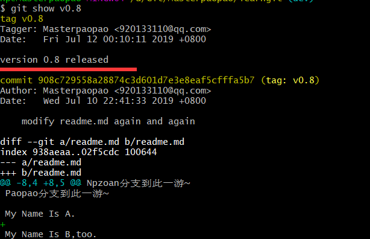

## 目录

* [一\.赛前热身](#%E4%B8%80%E8%B5%9B%E5%89%8D%E7%83%AD%E8%BA%AB)
    * [1\.知识回顾](#1%E7%9F%A5%E8%AF%86%E5%9B%9E%E9%A1%BE)
    * [2\.问题记录](#2%E9%97%AE%E9%A2%98%E8%AE%B0%E5%BD%95)
    * [4\.解决问题](#4%E8%A7%A3%E5%86%B3%E9%97%AE%E9%A2%98)
    * [5\.暴力重装](#5%E6%9A%B4%E5%8A%9B%E9%87%8D%E8%A3%85)
    * [6\.试验同步](#6%E8%AF%95%E9%AA%8C%E5%90%8C%E6%AD%A5)
* [二\.分支管理](#%E4%BA%8C%E5%88%86%E6%94%AF%E7%AE%A1%E7%90%86)
    * [1\.开场白](#1%E5%BC%80%E5%9C%BA%E7%99%BD)
    * [2\.备胎分支](#2%E5%A4%87%E8%83%8E%E5%88%86%E6%94%AF)
    * [3\.玩转分支](#3%E7%8E%A9%E8%BD%AC%E5%88%86%E6%94%AF)
    * [4\.深入分支](#4%E6%B7%B1%E5%85%A5%E5%88%86%E6%94%AF)
    * [5\.再来一遍](#5%E5%86%8D%E6%9D%A5%E4%B8%80%E9%81%8D)
    * [6\.切换分支](#6%E5%88%87%E6%8D%A2%E5%88%86%E6%94%AF)
    * [7\.初步小结](#7%E5%88%9D%E6%AD%A5%E5%B0%8F%E7%BB%93)
* [三\.协作分支](#%E4%B8%89%E5%8D%8F%E4%BD%9C%E5%88%86%E6%94%AF)
    * [1\.解决冲突](#1%E8%A7%A3%E5%86%B3%E5%86%B2%E7%AA%81)
    * [2\.合并历史](#2%E5%90%88%E5%B9%B6%E5%8E%86%E5%8F%B2)
    * [3\.接管分支](#3%E6%8E%A5%E7%AE%A1%E5%88%86%E6%94%AF)
    * [4\.文件问题](#4%E6%96%87%E4%BB%B6%E9%97%AE%E9%A2%98)
    * [5\.删除分支](#5%E5%88%A0%E9%99%A4%E5%88%86%E6%94%AF)
    * [5\.分支总结](#5%E5%88%86%E6%94%AF%E6%80%BB%E7%BB%93)
* [三\.复杂协作](#%E4%B8%89%E5%A4%8D%E6%9D%82%E5%8D%8F%E4%BD%9C)
    * [1\.推送远程](#1%E6%8E%A8%E9%80%81%E8%BF%9C%E7%A8%8B)
    * [2\.协作开发](#2%E5%8D%8F%E4%BD%9C%E5%BC%80%E5%8F%91)
    * [3\.变基历史](#3%E5%8F%98%E5%9F%BA%E5%8E%86%E5%8F%B2)
    * [4\.最终总结](#4%E6%9C%80%E7%BB%88%E6%80%BB%E7%BB%93)
* [四\.标签管理](#%E5%9B%9B%E6%A0%87%E7%AD%BE%E7%AE%A1%E7%90%86)
    * [1\.打上标签](#1%E6%89%93%E4%B8%8A%E6%A0%87%E7%AD%BE)
    * [2\.管理标签](#2%E7%AE%A1%E7%90%86%E6%A0%87%E7%AD%BE)
    * [3\.最后总结](#3%E6%9C%80%E5%90%8E%E6%80%BB%E7%BB%93)

## 一.赛前热身

Author：Masterpaopao

本博客已经上传Github：https://github.com/Masterpaopao/masterblog/tree/master/Git%E4%B8%8EGithub

Git是目前世界上最先进的分布式版本控制系统（没有之一）。

学习参考文献：https://www.liaoxuefeng.com/wiki/896043488029600

&nbsp;

#### 1.知识回顾

现在，我会假设两种快乐的情景，帮助你梳理一下你到底在做什么。

&nbsp;

①你在你的Git路径里面，手动创建了一个文件夹，进去之后，你用Git Bash使用git init生成Git仓库

然后你就开始往里面添加进去你的项目，还编辑了应该有的README.md

这个时候，你去Github手动创建了一个一样名字的仓库，复制了SSH链接，假如这个仓库叫paopao

然后你在你的Git Bah的这个新的仓库下，输入了链接远程Git仓库的命令：

`git remote add origin git@github.com:Masterpaopao/paopao.git`

然后你在本地进行一系列的add + commit操作

然后又紧接着输入了`git push -u origin master`（如果你的分支还只是master单分支的话）

这时候，你就可以点一根烟，眺望窗外，等待Github同步完成。

往后余生，只要再做修改，只需要走一遍add/rm + commit +push 同步到Github。

（经过后面的测试，这个origin只能用一次，需要起别的名字，建议无脑选下面的方法）

&nbsp;

②你首先在Github网站上建立了一个paopao仓库，并且你还同意了编辑README.md

于是你在网页上写好README.md之后，复制了SSH地址，打算克隆到本地

于是你在Git Bash的主目录，输入了`git clone origin git@github.com:Masterpaopao/paopao.git`

自动生成了一个paopao文件夹，里面有一个.git。

然后你进去cd paopao，开始在里面添加进去你的项目，一切完成以后

你开始add + commit + push的流程，同步到Github仓库。

于是你的上传到Github任务也完成了。

&nbsp;

看懂了吗，我上面的两个情景，假设了你上传项目到Github的两种方式。

在你上传的过程中，你难免会有手忙脚乱，不知道自己到底进行到了哪一步，可以git diff

①git diff filename：比较文件在工作区与暂存区的变化（在工作区改动文件，还未add+commit）

②git diff --cache filename：比较文件暂存区与当前版本库的变化（已经将文件添加进去暂存区，但还未提交）

③git diff HEAD filename：比较工作区与当前版本库的变化（说白了，就是看你的改动还没被commit）

&nbsp;

当你弄得一塌糊涂的时候，亲亲，这边建议您直接版本回退哦~

先使用git reflog查看你想回到的版本号，然后直接git reset --hard 版本号进行回到过去

问题解决了吗，祝你生活愉快哦~

&nbsp;

#### 2.问题记录

也许大家都自己捣鼓了一些Git与Github的一些实战，也上传了一些项目，在这个过程中难免遇到一些问题。

现在我要说一个最著名的问题，就是上传到Github的单个文件大小的限制

默认的Github的单个文件限制是4M，我们可以改设置到100M，这是Github所允许的最大范围

输入git config http.postBuffer 524288000，或者修改.git下的config，修改最后一行的参数即可，如果想要上传超过100M文件的办法，对不起

我研究了一下，学习成本太高，日后紧急需要再研究，目前的方法是放在百度网盘提供链接。

&nbsp;

但是这个过程，我尝试了4次commit，都是含有超过100M的单个文件的Git仓库

第五次的时候，我放弃了抵抗，默默删掉了那些超过100M的单个文件，并git rm + git commit

然后就是美滋滋的git push上到Github，此时此刻，我发现了不对劲。

就是我的git push同步地依旧是第一次commit的那个Github仓库，我的那些文件依旧还在！

吓得我关掉了进程，查看了下git status


好家伙！我现在的master分支居然堆着四个commit的版本库，最新的commit未能覆盖掉！

按理说这是不正常的现象，因为我如果不git push，就单纯的add/rm + commit

我commit此时指向的版本库一直始终为一个，被不停地更新了，但是此时我有4个！

&nbsp;

然后我又git reflog，我的HEAD指针确实指向着我最新的commit版本库

但是此时等待被同步远程Github仓库的却有四个commit版本库！


所以，我得出了一个结论，git push的失败是有成本的

每当你git push失败之后，你的commit版本库就会被打回，这个时候，你又不知道，你又匆匆忙忙删掉那些版本库，又匆匆忙忙地git rm + git commit，又再一次git push，此时最新的commit并未能覆盖到被打回的那个，所以这一次的git push又失败，这一次的commit又被打回停留在那儿……

所以就造成了现在堆积着四个commit的尴尬局面，然后我百度了一下网上的解决方案，又发现学习成本太高


所以我们只能采用笨方法解决。

&nbsp;

#### 4.解决问题

像我这么笨的人，只能想到版本回退，说迟快，那刹间，我回到了第一次提交之前的版本


然后我输入git status，看看当前状态发生了什么


这是什么意思呢，这是我当前分支的内容，已经落后于远程版本库的分支内容，胆子大的同学，可以直接git pull

就可以将远程分支的内容强行覆盖到本地，这样一来应该不会出任何问题了。

但是我没使用这个方法，因为当时的我没有意识到这个git pull，于是我又进行了下一步

重新将我的笔记文件放进去，过滤掉我的超过100M的单个文件，将这些放在百度云网盘

然后我直接一波git status


&nbsp;

没问题，我继续将这三个git add进去，然后再git commit，提交到当前分支的版本库

当我在git push之前，最后一次git status，我看到了不一样的东西


这是什么意思呢，就是说你的分支与origin/master出现了分歧，不能进行下一步的操作

它甚至提供了解决方案，使用git pull将远程的分支强行覆盖现在的分支，但是当时的我没有选择这个

而是百度了一些玩意，输入了两个命令：

git rebase origin/master ：合并本地所有本地提交的commit

 git pull --rebase：线性地将所有分支合并在一起

然后我再git status查看状态，似乎可以被git push了


&nbsp;

#### 5.暴力重装

如果你的问题还是没能解决，考虑采纳暴力重来，毕竟你如果再纠缠下去，就是下面要学习的分支管理内容了，我们目前还是暂时处理不了分支管理的冲突的，所以你按照我下面写的步骤来:

首先删掉本地的那个Git仓库，比如你正在纠缠的叫做master文件夹，先回到父目录，直接rm -rf master/

然后上Github，找到一样名字的那个仓库，点击Settings


进去之后，直接滑到最下面，就是最后一个选项， Delete this repository


弹出一个窗口，你输入这个仓库的名字进行验证，你就能删除成功了呢。

然后再次创建一个Git仓库，复制SSH到本地克隆，再来一次项目文件的添加，就可以了。

&nbsp;

#### 6.试验同步

我们要试验在Github上的任何可能性的操作。

比如我在Github上面修改了文件，这个修改会同步到本地吗？让我们一起来试验一下

打开我们学习Git时所使用的第一个仓库，也就是learngit仓库

然后我们还真找到了可以修改的地方，就是这个readme.txt，按照Github的习惯应该是README.md


经过我的修改以后，现在就变成了这个样子


现在我们需要回到Git Bash，进入我们的learngit仓库，压一手git status

结果一看，糟糕，没有任何同步，是不好的感觉！


所以我们得出一个结论，在Github网页端修改文件，对于本地的Git仓库是没有任何反应的

所以这个时候我们应该怎么办啊，不慌，一条命令将远程仓库的内容给同步到本地

输入git pull（没错，就是push的反义词），同步到本地


现在来验证一下是否真的同步成功。


&nbsp;

好了，我们的赛前热身阶段到此为止，我们接下来就要进入一个全新的学习阶段。

&nbsp;

## 二.分支管理

#### 1.开场白

在进入分支的学习之前，我们来回顾一下上篇博客中我们完成的操作，我们克隆了一个项目，并参与了项目的开发，然后完成开发以后将这个修改过后的项目pull request给了原作者

那你们有没有想过，作者的那个项目，其实就是项目的mastert分支呢？

我们克隆过来修改的项目都是其他的分支，也就是一种独立的时间线进行修改？


让我修改完项目以后，我是不是就要将这个修改后的分支给pull request过去，假如作者觉得我改的很好，于是就将我的改动合并到原项目—不对，应该换个说话，于是将我的分支合并到他的master分支完成修改。


所以，根据上面的图，我们所学习的一直只有一个master分支，也就是主分支，一条时间线，我们在这一条线上一直往前修改往前延伸，这意味着全程只有一个人参与开发，也意味着你只在一条线上的修改就是修改，你并没有备胎，没错，分支的作用不只是多人协作开发，还可以是备胎开发的作用，这便是我们要学习分支的原因。

&nbsp;

#### 2.备胎分支

所谓的备胎分支，就是学会创建分支然后合并分支的过程。

创建分支到底是个什么样的概念，当我在当前master分支创建一个分支的时候，这个HEAD指针就会指向新分支

然后我的所有改动都建立在这个新分支，原master分支不受影响。


让我们打开Git bash，进入我们学习用的learngit仓库

输入git branch paopao，这是创建了个叫paopao的分支。

然后再输入git checkout paopao，这是切换到了paopao分支。


当然了，这两条命令可以汇总到一条命令，也就是创建并切换到新的分支

git checkout -b npzoan


现在，我们是不是有了三个分支，输入以下的命令看一下当前的所有分支

git branch


&nbsp;

#### 3.玩转分支

现在，我们有了三个分支，现在可以开始玩转分支了，现在我们就基于Npzoan上面进行修改readme.md


这是我新增添加的内容，出去以后，看看git status的反馈


它清晰地指出了改动在于哪个分支，当然了，我在npzoan分支的改动肯定是影响不了其他分区的

然后我熟练地进行add + commit，保存修改到当前分支的版本库


这个时候，有意思的问题来了，我们可以不可以直接git push上去？

当然是不行的，哈哈，我的远程Github仓库上面只有master分支！无法提交！

&nbsp;

话说回来了，我们该考虑下一步地合并分支了，将我在npzoan分支的改动保存到paopao分支

先使用git checkout paopao切换到paopao分支，然后输入以下的命令进行合并

git merge npzoan


然后我们就在paopao分支检查一下readme.txt


内容确实被添加进来了，现在我们的npzoan分支已经毫无用处了，现在输入下面命令删除npzoan分支

git branch -d npzoan


现在只有master分支与paopao分支了，现在我们想一个思考题：

当我的paopao分支合并进去以后，我们paopao分支需要add+commit吗？输入git status看看


看来是不需要的，合并分支的操作应该是直接保存修改到最终的分支版本库。

&nbsp;

#### 4.深入分支

现在我们有了两个分支，一个是什么都没动的master分支，一个是新添了内容的paopao分支，我们现在需要干什么呢？我在留言区看到了一个有意思的坑，所以我会在这儿重新演示一次。

在当前的paopao分支上面修改一下readme.md的内容，注意，不要进行后续的add+commit


然后git status一下，只是确保我们没有进行add + commit操作，当前的工作区肯定是不干净的


好，在这儿停顿，我们直接输入git checkout master，直接来到master分支


我透……我怎么不能切换过去，留言区的是什么鬼……难道我的git是最新版本吗？


如果你们能够切换过去，你们可以参考以下的两篇博客进行自由地探索

https://blog.csdn.net/w522301629/article/details/81331273

https://blog.csdn.net/qq_37140632/article/details/85786089

当然了，我还是不死心的，我决定先add一下，再直接切换到master分支


还是不行，我算是明白了，我这个Git是最新版本的，对我来说，当前工作区不干净的话，我是不被允许切换到其他分支的，这也算是个好事吧，不再起冲突。

所以我进一步的commit提交了，然后总算是能切换到master分支了

然后直接合并paopao分支进master吧，然后再删除paopao分支，查查当前的git status


看到这个by 2 commits，千万别慌，这是正常的，这是因为两个新分支的内容最终被合并到matser分支

然后查看readme.md是否真的新添增了内容，直接提交到远程仓库


然后检查一下，远程仓库的内容是否被同步变化。


&nbsp;

#### 5.再来一遍

我百度了一下，这个未add+commit直接切换到分支的问题跟版本的关联度并不是很高

于是，我反思了一下，应该只有master是个特例，不允许不干净的工作区直接切换过去

所以我又试验了一下，直接创建了两个新的分区


然后我在paopao2分支，修改一个文件，不add+commit，直接切换到paopao1分支


成功了！终于可以试验一下留言区的那个大BUG了！

&nbsp;

现在的情况是什么，也许你没有看明白：我在当前分支修改一个文件的时候，这个文件并未经过add + commit，现在我直接切换到其他的分区，输入当前的git status


一个奇怪的现象发生了，不是说分区都是独立的吗？不都是互不影响的吗？

为什么我在这个分区的改动，只是没有add + commit，却被带到了另外一个分区了？

我在百度上得到的答案是：所有分支的工作区与暂存区都是共享公用的。

&nbsp;

所以我们开始解决问题，就打开上面两个csdn链接细细阅读

我们必须处理当前的情况：我在这个分支修改文件以后，忘记保存，贸然直接切换到其他的分支了，其实压根不难。你只需要git checkout paopao2回去刚才的分支就行了，哈哈哈！

当然了，也许你是故意切换的，因为我们知道，所有分支的工作区与暂存区是公用的，所以你可以不用切换回去，你可以直接在这个分支直接进行add + commit即可，能弄到最终的结果就好了。

&nbsp;

#### 6.切换分支

问题就来了，现在才是一个真正的场景：我当前分支上的工作还没做完，不能add+commit提交，但又想去其他分支，这个时候我们该怎么办?

我们可以使用git stash这个系列的命令（参考：https://blog.csdn.net/qq_37140632/article/details/85786089）

首先先在paopao2分支输入git stash，隐藏当前的工作区现场


我们可以看到，当前paopao2的工作区就干净了，这时候你可以直接切换到paopao1分支去做事情了

&nbsp;

当然了，你如果办完事情，你想回来了，你就切换回来到paopao2分支

输入git stash list查看当前隐藏工作区的内容


然后输入git stash apply恢复工作区的内容


这个时候，一切就都回来了，就是这么的简单。

当然了，git stash apply这条命令有个缺陷，就是恢复工作区的时候并不会删除stash的记录

输入git stash drop来删掉stash list的记录。


这样就删掉了，其实上面的两条命令其实可以合并到一条命令：

git stash pop

恢复工作区的同时删掉stash list的记录。

&nbsp;

以上的命令都是基于只有一个stash的情况进行的，实际情况是我们会有多次stash，为什么会有多次stash呢，这其实不难想象啊，比如一个项目里面有多个文件夹，如果这多个文件夹都要进行改动，那肯定不能直接这样，最好的办法肯定是每改动一个文件夹就stash一次，改动几个文件夹就几个stash，这样有利于有秩序地提交修改。

我们也注意到了，每个stash都是有编号的：


所以当你需要恢复的时候，先git stash list看一下，然后你如果决定提交其中一个stash了

直接输入git stash pop stash@{0}将这个stash恢复到工作区，并删除掉这个在stash list里的记录。

这样你就可以完成多个stash的有秩序地提交。

&nbsp;

#### 7.初步小结

强记：

查看所有的分支：git branch

创建并切换到新的分支：git checkout -b  <name>

合并某分支到当前分支：git merge <name>

删除掉指定的分支：git branch -d <name>

&nbsp;

了解：

创建分支：git branch <name>

切换分支：git checkout <name>

隐藏当前工作区：git stash

&nbsp;

## 三.协作分支

#### 1.解决冲突

人生不如意之事十有八九，有些事情并不会一帆风顺，总有一次是你无法合并的时候

我们现在就模拟一次合并分支失败的案例：

按照惯例，我们还是先创建两个新的分支，取名为A与B，这样就不会影响原master分支

然后我们进入B分支，修改一下readme.md的内容


然后将这个改动进行add+commit，保存到当前分支的版本库。


然后我们切换到A分支，同样也是修改readme.md不一样的内容，然后再add+commit


现在，我们就来试验一下，我们将B分支合并到A分支，也就是在A分支输入命令git merge B


毫不意外地是，果然报错了，因为文件修改不一致，无法完成快速合并。但是你会发现此时的分支变化了


这个时候我们就只能执行接下来解决冲突的方式。

&nbsp;

首先查看一下这个文件的内容，发现它也变化了


<<<<<<<< HEAD代表着当前分支的修改内容，>>>>>>>>> B表示着被合并分支的修改内容

中间的=====只是一个分隔符，现在我们直接vi readme.md修改一下内容


改完之后，问题就解决了，直接进行下一步的add + commit，完成最终的合并


可以看到，经过add+commit以后，当前的分支状态终于恢复到了正常。

然后我们输入一条命令，可以查看有关于分支操作的历史纪录，也是git log的演化：

git log --graph --pretty=oneline --abbrev-commit


这便是记录分支合并的日志，不过别忘了删掉那个B分支，它已经没作用了。

&nbsp;

#### 2.合并历史

我们在上面，其实可以知道git merge这个命令属于快速合并，也就是这儿

我将上面的A分支直接合并到master主分支，我们会看到这样的信息


然而这个方式并不是很推荐，因为这样会丢失分支的信息，git log中并不会有详细的信息记录

而是还是处于合并时所写的commit语句


这样肯定是不利于多人协作开发，缺少足够的信息去支撑合并到master分支。

&nbsp;

因为我们知道，master分支并不适合用来干活，肯定是要创建一个分支去干活，干完活以后，经过测试以后再直接合并到master分支，但是能直接进行git log吗？那样缺少分支的信息。

所以我们正确的做法应该如下：

继续回到A分支，随便修改点readme.md的内容，然后add + commit

然后我们回到master主分支，即将合并A分支的时候，我们应该输入以下的命令:

git merge --no-ff -m "modify readme.md with no-ff" A


这是一个什么样的操作呢？就是合并的同时直接commit，并给出提交的信息，我们直接git status可以验证


工作区是干净的，好，最关键的时候来了，查看一下分支的历史纪录

git log --graph --pretty=oneline --abbrev-commit


看到了吗，相比较直接git merge的方式，这种no-ff的方式完善了合并时候的描述语句，使协作流程看起来更加的清晰了，这样就知道你合并时的相关信息了。

&nbsp;

#### 3.接管分支

其实，这一节接管分支的概念我在上面就已经讲过了，无非是git stash命令的使用

但是，我们换个场景重新教学一遍，并没有坏处。

&nbsp;

当你在A分支（提前给A分支创建一个新的分支为B）上面进行干活的时候，你修改了readme.md内容


这个时候你本应该继续写下去，这时候你突然接到了一个电话，同事急忙忙地跟你说，要你帮忙解决一下B分支的BUG，但是你现在又脱不开身，因为你现在正在干的活还需要几个小时解决，并不能马上提交……

于是你只好使用git stash来隐藏一下你这个分支的工作现场

输入git stash


现在你切换到了同事的B分支，替同事改BUG

当然了，你可不能直接在B分支直接改BUG，这样容易影响同事的分支

你对B分支又创建了一个分支，命名为B-BUG分支，在这个分支上改好代码以后，你进行add + commit

然后使用no-ff的方式将B-BUG分支进行合并到B分支，于是你替你的同事改好了BUG。

&nbsp;

这个时候，你又潇洒地回到了你的分支，继续你的工作，但是你直接git status你是看不到的


因为你将你的工作现场给隐藏起来了，直接输入git stash pop

恢复工作现场的时候删除掉stash list里面的记录


就这样，你完成了在开发的中途中，跑出去给同事干活又会来的过程。

但是留言区出了个争吵，在争论这一节到底有什么作用，我看到了一个很有意思的回答，所以截图给你们看


&nbsp;

#### 4.文件问题

注意，我在上面示例git stash的教学中，全程都是用文件的内容去教学的

现在我们必须考虑一个情况，如果是新增添一个文件的话，再去stash的话，会是怎么样的？

毫无疑问，这得分两种情况，就是文件未被add或者已经被add，在这儿之前我们可以看一段这位大神的解释


他的这段话说明了什么？

1）新创建的文件还没被add过的，暂存区所没有的文件叫做未被跟踪的文件

2）已经被add过进去暂存区的，再次被修改，还未被add的文件叫未被加入到暂存区的文件

说明应该存在三种情况：

①在当前分支工作的时候，新增加了一个文件，但是并没有add，然后被叫去改BUG

②在当前分支工作的时候，修改了一个文件，但是没被add，然后被叫去改BUG

③在当前分支工作的时候，修改了一个文件，但add加入了暂存区，没被commit，然后被叫去改BUG

肯定很多人会问，怎么没有第四种情况，修改了一个文件过后，add+commit，然后被叫去改BUG

大哥，你都已经commit了，你当前的工作区已经干净了，你去改BUG完全没任何问题啊！

&nbsp;

先来讲一讲第一种情况吧，首先先把A分支与B分支清理一下

①在当前分支工作的时候，新增加了一个文件，但是并没有add，然后被叫去改BUG

首先在A分支，创建一个新的文件new.txt，此时的new.txt是未被跟踪的文件

然后再修改readme.md的内容，现在是这个样子的


然后我被叫去改BUG，按照惯例git stash进行保留一次后，再来看看git status


我们发现，存在一个untracked问题，我们这个时候肯定是不能贸然切换到B分支去改BUG的

所以我们必须再git stash一次，却发现遇到这样的语句


所以，在针对未被追踪的文件的时候，我们在git stash之前需要git add一下，让这个文件存在于暂存区


所以我们就可以再次git stash了，然后最后看看git stash list看看我们的两次stash记录，分别操作两个文件


然后我们就可以切换分支去改BUG了。

改完BUG以后，我该怎么恢复工作现场呢？当然是连续两次git stash pop进行出栈


发现了吗，git stash就是一个压栈的过程，释放的时候就先进后出的模式进行出栈。

&nbsp;

再来看看第二种情况

②在当前分支工作的时候，修改了一个文件，但是没被add，然后被叫去改BUG

所以，在进行实验之间，我们先把A分支的new.md给commit了，再进行测试

然后进行修改new.txt的内容，此时new.txt变成了未被加入暂存区的文件


现在，就是两个未被add加入到暂存区的文件，但是这些文件已经被跟踪了

这种情况就很简单了，一次git stash，将这些东西全部压栈就行了。

怎么恢复我就不说了。

&nbsp;

再来看看最后一种情况，这就更简单了

③在当前分支工作的时候，修改了一个文件，但add加入了暂存区，没被commit，然后被叫去改BUG

我将上面的给出栈出来，恢复工作现场，然后add进去new.md


同样的是，我们也只需要一次git stash全部压栈进去，就可以了


&nbsp;

所以，我们文件问题的关键矛盾点在哪儿呢？

在于这个新建的文件，如果你新建的文件还未被add过，这就是未被追踪的文件，未加入过暂存区，所以我们git stash压栈的时候，一定要对这个文件git add一次，然后再多次git stash就可以了，因为这属于特殊情况，并不能一次性git stash压栈进去。其他的情况你就不用管了，直接git stash再切换到别的分区即可。

&nbsp;

#### 5.删除分支

删除分支是再正常不过的时候，假如你接到一个电话，说要开发一个功能

于是你创建了一个分支，你开始着手功能的开发

可当你开发完毕，已经add + commit的时候，你准备合并分支的时候

老板给你打来电话，这个功能太冗余了，还是删掉吧

先对上面的A分支进行git stash pop ，然后全部add + commit

最后切换到master分支，进行删除分支

输入git branch -d A，却遭遇到了报错


报错说，这个分支还没被合并，确定要删除吗？要的话要输入-D

这是很正常的，因为你在那个分支已经完成了一系列的add+commit，这也是防止你误删分支的操作

git branch -D A

强制删除掉这个分支

就这样，你学会了如何删除一个分支。

&nbsp;

#### 5.分支总结

当你合并分支的时候遇到冲突，修改冲突以后再add+commit，即可合并成功。

对了，合并分支的时候最好不要直接git merge，而是选择带分支记录并重定义提交语句的合并方式

git merge --no-ff -m "commit时所需要解释的语句"  被合并分支的名字

（例如：git  merge  --no-ff  -m  "modify readme.md with no-ff"   A）

&nbsp;

一条又臭又长的查看分支日志，但你又不得不去使用：git log --graph --pretty=oneline --abbrev-commit

&nbsp;

当你在手头的工作没完成的时候，你必须要去另外一个分支去干活，这个时候你需要git stash保留工作现场

但是你在干活的过程中如果新建了一个文件，请务必先git add再git stash，直到全部git stash干净了为止

然后干完活以后直接git stash pop出栈恢复工作现场

&nbsp;

删除你已经工作好的分支的时候，是输入git branch -D 分支的名字，参数是大写的D。

&nbsp;

## 三.复杂协作

#### 1.推送远程

我们在上面，学会了如何灵活运用分支进行开发，这一切好像与master分支无关

因为master分支适合作为一个最终版本的分支作为存在，然后进行上线测试，所以我们的开发都是在其他的分支，开发完了，测试完了再合并到master分支进行上线。

那么我们开发的分支到底叫什么，叫做dev分支，也就是develop(开发)的简写。

所以我们现在就创建一个dev分支，作为开发分支


现在，我们必须考虑如何推送远程分支的事情了。

&nbsp;

我们在前面推送或者克隆的时候，始终只有一个远程仓库和一个分支，也就是origin与master

我们可以通过输入git remote -v去查看实际的权限情况


fetch与push说明了我们有着对远程仓库克隆与推送的权限，如果你的权限不全，应该会少一行

我们在前面在本地git修改成功想推送的时候，都是git push origin master

现在我们知道master分支不适合用来开发，应该是使用dev分支，所以我们的远程项目应该有两个分支

一个master分支用来最终版本的分支，一个dev版本用来做正在开发的分支

所以我们现在就推送dev分支上面，让远程项目拥有两个分支

git push origin dev


成功以后，我们在Github查看一下分支的情况，成功了！


现在，你的团队可以直接克隆远程的dev分支来进行开发，再进行推送修改。

&nbsp;

#### 2.协作开发

现在，我们的远程仓库项目上面，已经有了master分支与dev分支，现在团队准备干活

为了模拟两个人在同时开发，请找到Git的主目录，创建一个你同事名字的文件夹


然后再打开一个Git Bash窗口，确保是两个人在干活


现在我们这个Huangdong同事，需要从远程仓库把dev分支拉下来进行开发

在Huangdong的git里面输入拉取远程仓库的命令

```
git clone git@github.com:Masterpaopao/learngit.git
```

但是拉取完之后，你进入这个learngit项目，查看分支，还是只有master分支


这是因为还未与远程的dev分支进行连接同步，所以需要先创建一个分支再关联远程dev分支

```
git checkout -b dev origin/dev
```


一切完毕以后，你的同事开始着手于dev分支的内容开发


然后你同事Huangdong经过add + commit + push整套流程，完成了开发并提交的过程。

&nbsp;

但是这个时候，你Masterpaopao也刚好要开发readme.md，并准备进行push的时候，发生了意外


它说我推送失败，因为我的同事的最新提交和我试图推送的提交有冲突。

其实倒数第二行黄句子也给出了解决方案，就是先git pull下来进行本地合并

但是直接git pull也失败了，看到报错，我又忘记与远程dev分支取得连接了


而且最后一行同样也给出了解决方案,先输入与远程dev分支取得关联的命令

```
git branch --set-upstream-to=origin/dev dev
```

再直接git pull，我们可以发现，远程的dev分支成功合并到本地


但是，我们合并是成功合并了，但是内容遭遇到了问题，还好我们就解决过一次同样的问题


很简单，改完以后直接add + commit + push，这样我就完成了我与同事的协作开发过程


在Github仓库上看看dev分支的效果


接下来，开发完了应该干嘛啊，当然是将两个人开发后的dev分支合并到master分支进行上线啊！

&nbsp;

这个时候，合并的任务却是交给Huangdong同事负责，他应该干什么啊？

先输入git pull进行同步远程仓库内容到本地，如果不行就git branch --set-upstream-to=origin/dev dev

然后Huangdong切换到master分支，输入git merge --no-ff -m "modify readme.md to mast" dev

然后再git push origin master，正式同步到远程仓库的master分支将功能上线

上面的工作完了以后，在Github查看master分支最终的上线结果


&nbsp;

#### 3.变基历史

这儿的变基并不是什么操作分支的记录，它是针对日志的输出方式的一种方案。

我们前面操作的合并，日志会这样记录：


它会详细地解释分支操作并提交合并的各个流程，更为直观地展现了每个功能详细地开发过程。

但是这个时候，另外一个学派出现了，他们认为日志不应该以这样的方式记录，而是从公司的整体项目大版本更新的方式来记录，应该舍弃掉这些过于详细的记录，每一个版本的更新应该只记录为一条日志。


我们先从分支的角度去开发一下，研究一下这么详细的记录是怎么来的

我们来到Masterpaopoa的dev分支，对两个文件修改并add + commit，然后看git status


看到了吗，这儿有两个commits，这便是记录详细操作的来源，在实际的项目中应该会有几十个commits

这个时候先挂着。我们打开Huangdong的git，同样也是修改两个地方，并直接add + commits + push

弄这些是要让我们的Masterpaopao推送失败，然后使用git pull，这时候会变成三个commits

&nbsp;

当Huangdong成功推送上去以后，我们回到Masterpaopao，输入git push origin dev


这个时候毫不意外地报错了，所以我们只能先git pull，然后修改一下合并带来的问题


然后修改完以后，再次add + commit，完事之后最后看看git status，你会发现


这儿居然有三个commits了！这个时候变基学派出现了，它说让我们输入git log --graph --pretty=oneline --abbrev-commit看看日志是怎么写的


变基学派认为，这样的日志记录方式，是毫无意义的，应该将这些记录合并到一条记录里面，代表一次整体的改动，而不是列出这么详细的操作记录，弄这么多commits的版本号，这没有任何意义，所以这个时候我们应该输入git rebase进行合并多个commits到一个

git rebase


这个时候我们再输入查看日志的命令，发现改动如下:


日志记录中，我们这一次的操作变成了最后一个commit记录，代表一次版本的更新，只需要在commit语句里面描述详细一点就行了。

然后我们就直接提交合并后的单个commit，完成推送到远程仓库的工作。

&nbsp;

这便是变基带来的日志记录方式，与合并带来的日志记录方式相比更加注重整体的迭代，版本的更新信息。

我在这儿有一段截图可以很好对比一下变基vs合并：


&nbsp;

#### 4.最终总结

当你和你的同事在对于项目的同一个分支开发的时候，你的同事先你一步提交推送

而你准备推送上去的时候，却遇到报错，远程库已经更新，于是你只能

1）先与远程仓库的那个分支取得联系：git branch --set-upstream-to=origin/dev dev

2）然后将远程仓库最新内容同步到本地：git pull

3）遇到合并后的冲突提醒，你于是就修改文件，然后提交：add + commit 

4）这个时候，你觉得，相关日志里面应该并到一次记录：git rebase

5）然后你就可以将最终版本推送到远程仓库了：git push origin dev

&nbsp;

但是别忘了一切始于开头，到底怎么参与远程仓库某一个分支的协作开发呢？

1）先把项目克隆到本地来：git clone git@github.com:Masterpaopao/learngit.git

2）然后创建并切换到你要参与协作的指定远程分支：git checkout -b dev origin/dev

&nbsp;

## 四.标签管理

#### 1.打上标签

打标签到底是什么？就是给版本号打标签！版本号又是什么？是这个！


试想，一般来说公司会提前往后开发好几个版本，但是正式上线却还在停留在原地

这是为了确保新开发的环境使用无误且给公司留足够的空间，让项目的上线不再那么匆匆忙忙

但是，你难道会大喊一声：”开发组，把版本号0ea183上线了！测试组，继续测试版本号f096e8c！“

你会这样喊吗？你念得顺版本号那几个字符吗？

倒不如这样喊：”开发组，把版本号v1.1上线了！测试组，继续测试版本号v1.2！“

这样是不是顺口多了？所谓的打标签其实就是一个命名过程。

&nbsp;

现在你当前的dev分支已经完成工作了，不如就趁热打铁， 给当前打个标签吧，输入

git tag v1.0

就可以给当前dev分支的版本库打上了v1.0的标签。

如果你不慎忘了你刚才打的是什么标签，你可以输入

git tag


当然了，你忘记给你昨天开发的版本打标签了，它本应该是v0.9，没关系

输入git log --pretty=oneline --abbrev-commit查看历史版本号记录，记下上一个的版本号


然后输入git tag v0.9 8bdc072打上标签，现在你再看看历史记录，就清楚地看见了两个标签


现在我们可以使用git tag来看看当前一共多少个标签


但是我们肯定要访问标签的详细状态的，这个时候输入git show<tagname>

git show v1.0


你还别说，这个标签打的还是非常非常详细的，但是你如果想要更加详细呢？

这个时候我们可以再找个版本号，来当一下v0.8，并在打标签的同时及逆行说明

git   tag   -a   v0.8   -m   "version 0.8 released"  908c729

输入完毕以后查看一下这个标签的详细信息

git show v0.8



也没什么特殊之处，就多了一行打标签的信息，这个仅作了解也行。

&nbsp;

#### 2.管理标签

学会了打标签必有管标签的知识，这很正常，你需要删除修改或者推送远程

当你打错了标签以后，你可以进行删除标签重新来过

比如就现在的v1.0，刚才没有补充打标签信息，所以删掉重打，输入

git tag -d v1.0


然后再重新打，这一次补充下标签信息

git tag -a v1.0 -m "this is a new tag for v1.0"


这便是如何删除打错的标签的操作。

&nbsp;

现在来讲讲如何就打好的标签直接推送远程仓库

其实我们回想一下，我们以前推送的命令都是git push origin dev

这个dev到底是什么呢？就是当前分支最新的版本库，这样无疑是不实用的

因为我们在真实环境当中，会连续往后开发三个测试版本，但是只将第一个测试版本上生产环境，慢慢测试

所以我们并不能直接使用git push origin dev的，而是找到第一个测试版本的commit版本号

给它打上一个标签为v1.0，然后输入git push origin v1.0，这才是真实环境中的推送操作。


有兴趣的同学，直接往后开发两个版本，这两个版本都打上v1.1，v1.2

然后你可以先推送v1.1，再推送v1.2，模拟一下真实生产环节中的git使用，我在这就不再示范了。

你可以在Github官网上可以看到打标签的信息


现在，我们知道，人都有犯错的时候，如果已经推送了错误的标签，并不慌，分两步撤销

1）先删除本地错误的标签：git tag -d v1.0

2）再删除远程错误的标签：git push origin :refs/tags/v1.0

刷新下Github官网，验证一下就行了。

当然了，你也可以是不想提前提交标签，或者是看错成今天上线，你只需要执行第二步就可以啦！

&nbsp;

#### 3.最后总结

当你看到这儿的时候，你应该明白，你的git入门已经彻底地完成了，从今以后的路就要你自己走了

如果想要看更多的Git高阶知识，请你认准官网：https://git-scm.com/book/zh/v2

我相信，现在的你，已经知道了什么是Git—

知道了Git基础命令，知道了如何使用Git仓库，知道了如何同步到远程仓库保存项目

也知道了分支管理，知道了如何使用分支开发，知道了如何参与多人协作分支完成项目

&nbsp;

同样的是，你也知道，只有你自己的努力才能改变自己，也知道，你的学习之旅还未结束—

你应该学会去主动学习服务器上的Git，也应该深入了解Git的分布式系统，你的路还很长。

&nbsp;

祝愿各位前程似锦！


